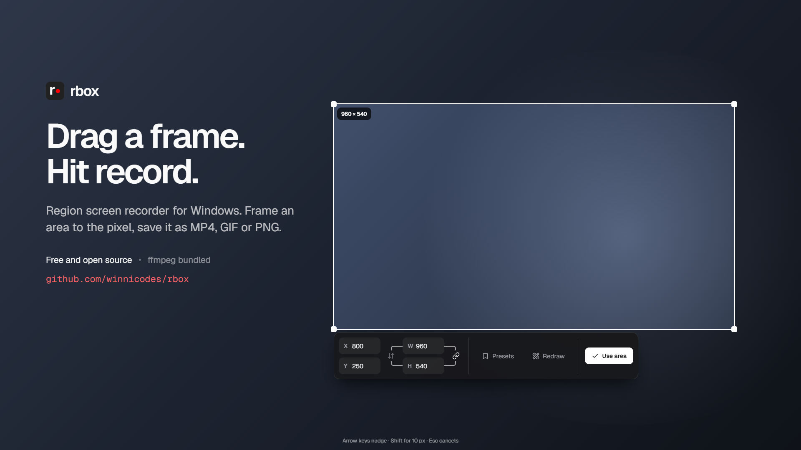
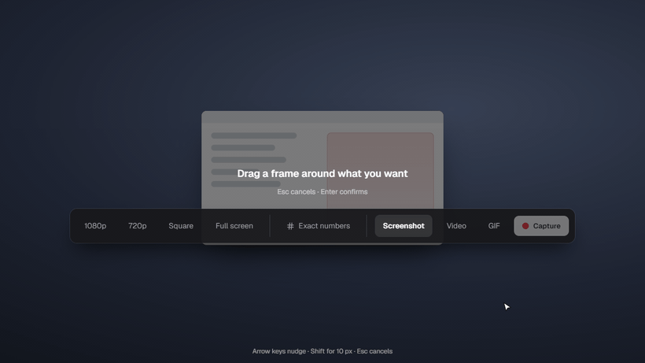
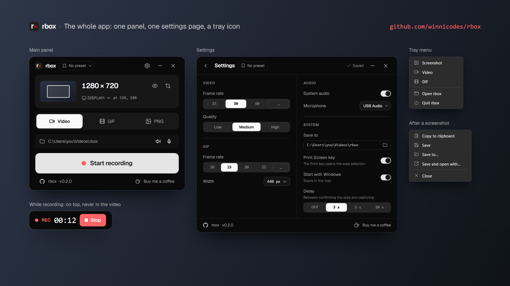
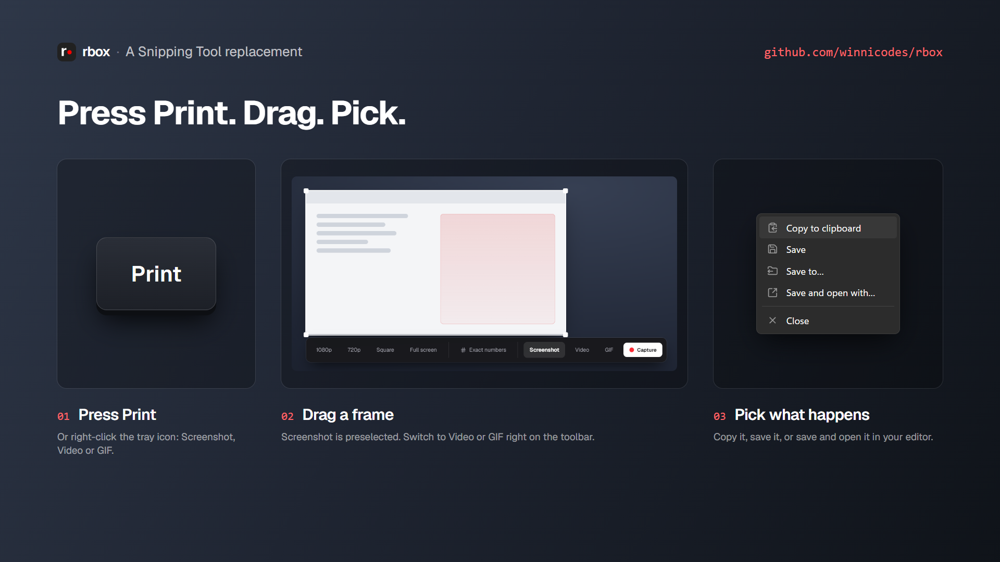

<div align="center">



<br>


[Download](#install) · [Usage](#usage) · [Build from source](#build-from-source) · [Developer guide](docs/dev.md)

</div>

---

## 🎯 What it does

rbox records **any rectangle of your screen** - a small region, a single window,
or a whole display. You pick the area once, correct it to the pixel, and record
it as often as you like. It also replaces the Snipping Tool: press Print, drag,
done.

- **Exact region.** Drag it, or type the numbers. The size fields sit right on
  the edge of the selection, so you never lose sight of what you are framing.
- **Three formats.** MP4 (H.264), animated GIF, or a PNG screenshot.
- **Print Screen and tray.** Print opens the area picker with Screenshot, Video
  or GIF. The tray menu offers the same. rbox keeps running in the tray.
- **Screenshot menu.** After a screenshot a menu opens at the pointer: copy to
  clipboard, save, save to, save and open with.
- **Delay.** 3, 5 or 10 seconds between confirming and capturing, with a
  countdown in the frame - time to open a menu.
- **System sound, no drivers.** Records what your machine is playing. No Stereo
  Mix, no VB-Cable, nothing to install.
- **Microphones.** Pick one, several, or none. They are mixed into the recording.
- **Multi-monitor and mixed DPI.** Move the area between displays and it keeps
  its size. Scaled displays are handled correctly.
- **Presets.** Save how you record - fps, quality, audio, output folder - and
  optionally the area too.
- **A visible frame.** A red ring marks the region while recording, and it never
  ends up in the file.
- **Stays out of the way.** While recording, the panel shrinks to a small bar
  on top of everything - and it is never part of the video.

Everything is saved to `Videos\rbox` by default (or the folder you pick), named
by timestamp.

## ✂️ Picking a region

<div align="center">
  
</div>

Drag anywhere. The size counts up while you pull, and the toolbar that follows
lets you snap to 1080p, 720p or square, go full screen, or type exact numbers.
A size preset keeps the frame's top-left corner and only changes its size.

## 🖼️ Screenshots

<div align="center">
  
</div>

That is the entire app. One panel, one settings page, a small bar while it
records, and a tray icon.

<a id="install"></a>

## 📦 Install

Download `rbox_<version>_x64.msi` from the
[Releases page](https://github.com/winnicodes/rbox/releases) and run it.

Windows 10 or 11, 64-bit. ffmpeg is bundled - there is nothing else to install.

The installer is not code-signed yet, so SmartScreen will warn you on first run.
Choose **More info → Run anyway**, or build it yourself from source.

<a id="usage"></a>

## ▶️ Usage

1. Click the crop button (**Select area**) and drag a rectangle. Correct it with
   the number fields on its edge, or pick a size preset (1080p, 720p, square).
2. Choose the format: **Video**, **GIF** or **PNG**.
3. Turn system sound and microphones on or off.
4. Hit record. The panel becomes a small bar with a timer.
5. Stop. The output folder opens with your file selected. A PNG skips the
   recording and opens the screenshot menu (see below).

### Print Screen and tray

<div align="center">
  
</div>

1. Turn on **Print Screen key** in the settings.
2. Press Print and drag a frame. Screenshot is preselected; switch to Video or
   GIF on the toolbar if you want to record.
3. Press Enter. A screenshot opens the menu at the pointer:

   | Entry | Result |
   | --- | --- |
   | Copy to clipboard | Image on the clipboard, no file |
   | Save | File in the output folder |
   | Save to… | File wherever you choose |
   | Save and open with… | File saved, then the Windows "Open with" dialog |
   | Close | Discarded (also Esc) |

Right-click the tray icon for **Screenshot**, **Video** or **GIF** - the same
picker, that format preselected. The X button sends rbox to the tray; quit it
from the tray menu. **Start with Windows** starts it straight into the tray.

### While picking a region

| Key | Action |
| --- | --- |
| Drag | Draw a new region |
| Drag inside / corners | Move or resize it |
| Arrow keys | Nudge by 1 px |
| Shift + arrows | Nudge by 10 px |
| Enter | Confirm |
| Esc | Cancel |

### Good to know

- The red ring is drawn **outside** the recorded area, so it is never part of
  the file.
- The eye button shows the ring without recording, so you can check your framing.
- Recording is refused below 500 MB of free disk space.
- Quitting mid-recording finishes the file first - it never leaves a broken MP4
  behind.
- If another app already holds the Print key, rbox says so and turns the
  **Print Screen key** switch back off.

<a id="build-from-source"></a>

## 🔨 Build from source

You need Windows 10/11, [Node 20+](https://nodejs.org),
[Rust](https://rustup.rs) with the MSVC toolchain, and the usual
[Tauri v2 prerequisites](https://v2.tauri.app/start/prerequisites/).

```bash
git clone https://github.com/winnicodes/rbox
cd rbox
npm install          # also downloads the ffmpeg sidecar
npm run tauri dev    # run it
npm run build:win    # build the MSI into src-tauri/target/release/bundle/msi/
```

Install Rust **before** `npm install` - the ffmpeg download names the binary
after your Rust target triple, which it reads from `rustc -vV`.

```bash
npm test                                           # TypeScript tests
cargo test --manifest-path src-tauri/Cargo.toml    # Rust tests
```

## ⚙️ How it works

The short version:

- **Capture** is ffmpeg's `gdigrab`, run as a Tauri sidecar and driven from
  TypeScript.
- **Every rectangle is in physical desktop pixels**, the coordinate space
  `gdigrab` expects. The selection overlay spans the entire virtual desktop, so
  Windows renders it at one DPI and a single scale factor keeps mixed-scaling
  setups correct.
- **Stopping sends `q` to ffmpeg's stdin** instead of killing it. A killed
  ffmpeg leaves an MP4 that no player will open.
- **System audio** is captured in Rust through WASAPI loopback and piped to
  ffmpeg over a local TCP socket. That is why no virtual audio device has to be
  installed.
- **GIF** is encoded from a scratch MP4 in two passes, palette first.
- **Screenshots** go to a temp file first; the menu decides whether it is
  copied, moved or discarded.
- **The recording bar** is excluded from capture with
  `WDA_EXCLUDEFROMCAPTURE`, so it can sit on top of the region.
- **Settings** live in `localStorage`. There is no settings backend.

The full explanation - architecture, the coordinate rule, the audio pacing, the
build pipeline and the traps - is in the **[Developer guide](docs/dev.md)**.

## 🤝 Contributing

Issues and pull requests are welcome. Please read
[docs/dev.md](docs/dev.md) first; it documents the invariants that are easy to
break by accident, especially around coordinates and the recording ring.

## ☕ Support

If you like rbox, you can [buy me a coffee](https://ko-fi.com/winnicodes).

---

## 📄 License

[GPL-3.0](LICENSE). rbox ships a GPL build of ffmpeg, so the GPL covers the
combined work - see below.

## 🎬 Built with ffmpeg

rbox does not implement any capture, encoding or muxing of its own. **All
recording, encoding and conversion is done by [ffmpeg](https://ffmpeg.org)**,
which ships with the application as a sidecar binary.

The bundled build is a **GPL** build from
[BtbN/FFmpeg-Builds](https://github.com/BtbN/FFmpeg-Builds). Because that binary
is distributed together with rbox, the GPL applies to the combined work, and
anyone redistributing it must make the corresponding ffmpeg sources available.

ffmpeg is a trademark of Fabrice Bellard, originator of the FFmpeg project.

<div align="center">
<sub>Made by <a href="https://github.com/winnicodes">winnicodes</a></sub>
</div>
